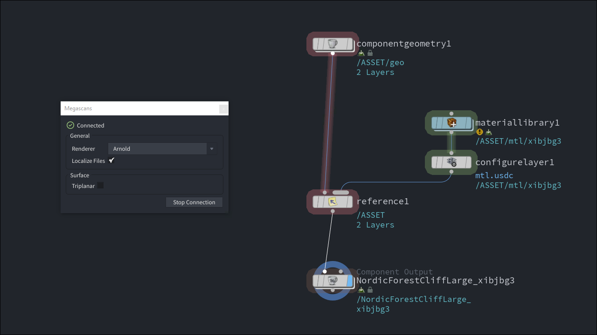

# Houdini Megascans

A Quixel Bridge plugin for SideFX Houdini Solaris to import Megascans assets directly into the stage.

This integration runs a local server that listens for exports from [Quixel Bridge](https://quixel.com/bridge) and
automatically imports them as Components into Solaris.



## Installation

Megascans is installed as a Houdini Package.

1. Go to the [Releases](https://github.com/beatreichenbach/houdini-megascans/releases) page and download the latest `megascans.zip`.
2. Navigate to your Houdini user preferences folder: `$HOME/houdini‹X›.‹Y›`
3. If you don't have a folder named `packages` in that directory, create it.
4. Extract the contents of the `.zip` file into the `packages` folder.
5. Restart Houdini. You can verify the installation by opening the **Package Browser** (**Windows > Package Browser**) and ensuring "Megascans" is listed.

**Example Folder Structure:**
```text
├── houdini21.0
    ├── packages/
        ├── megascans.json
        └── /megascans
            └── (HDA files)
```

## Usage

1. In Houdini, open the **Megascans > Bridge**.
2. In Quixel Bridge, go to **Edit > Settings > DCC Apps** and set the export target to **Houdini** (Custom Socket Export on `localhost:24981`).
3. Select an asset in Bridge and choose **Export** — the asset will appear automatically in the Solaris stage.

> **Note:** Bridge must be running on the same machine. The Houdini plugin starts a socket server on port `24981` by default.

## About this Repository

| Directory | Description                                                                                                              |
|-----------|--------------------------------------------------------------------------------------------------------------------------|
| `src/`    | Houdini package definition and plugin files. During the release action they get packaged in the `megascans.zip` archive. |
| `quixel/` | The source code for the Bridge server and USD import logic.                                                              |
| `build/`  | Build directory used to generate the release package.                                                                    |

### Localize qt-material-icons

```shell
qtmaterialicons -o megascans --styles outlined --sizes 20 --names check_circle circle
```

## License

Copyright (c) 2026 Beat Reichenbach. This project is licensed under the [GPLv3 License](LICENSE).
